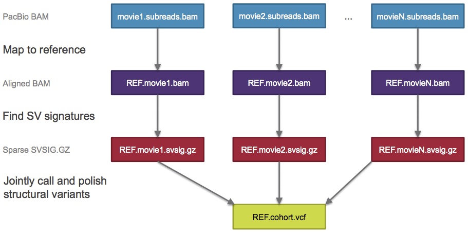
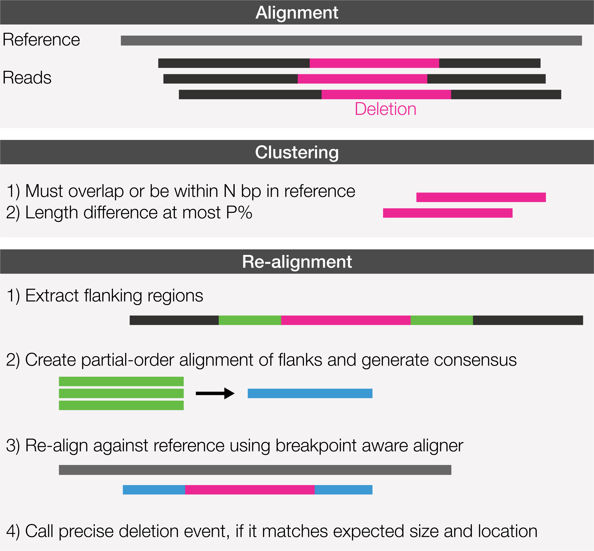
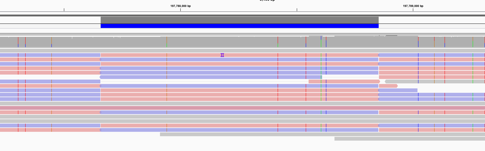
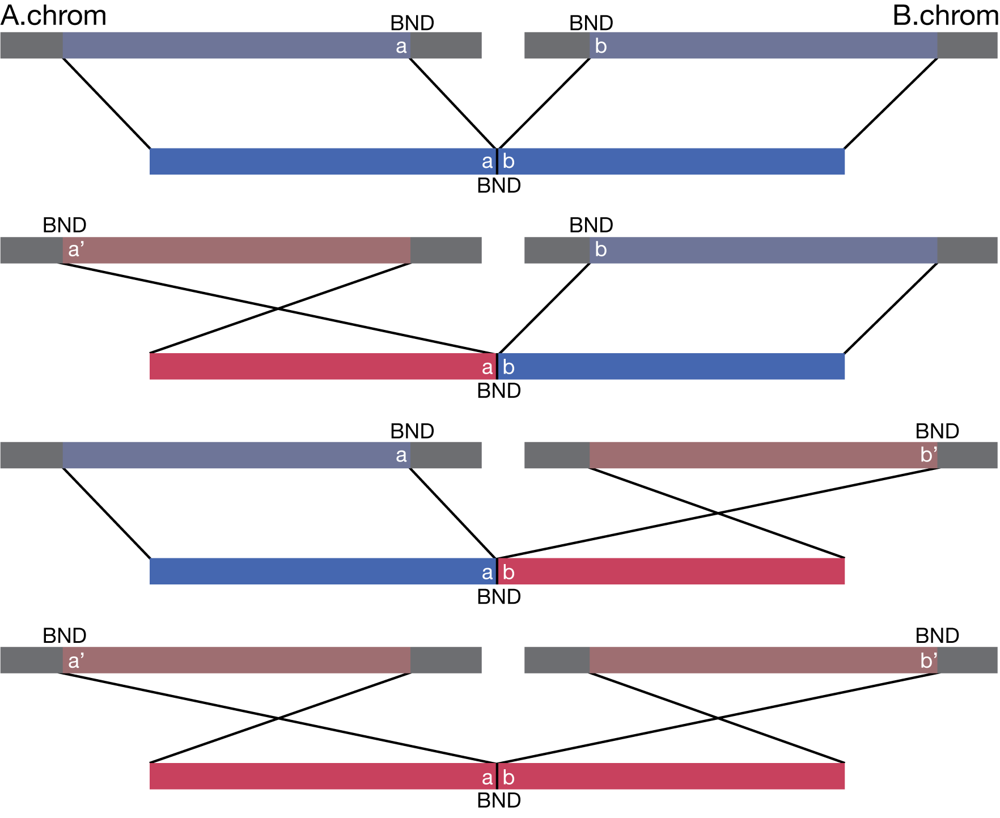
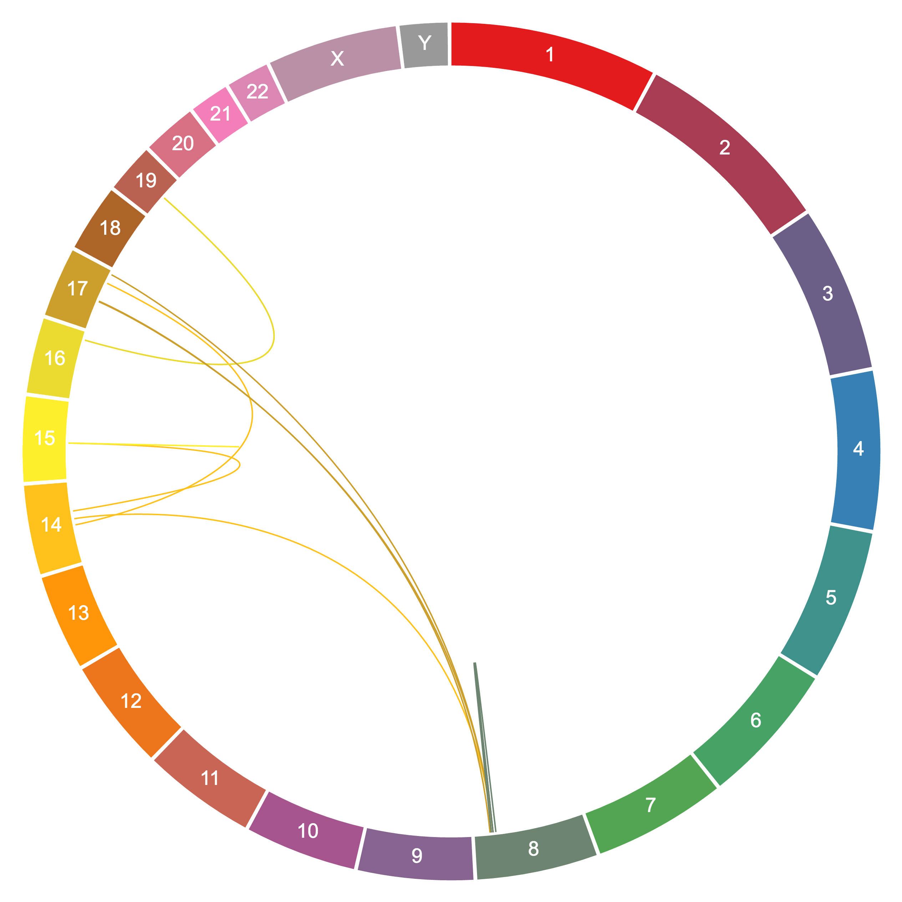

<h1 align="center"></h1>
<h1 align="center">pbsv v2</h1>
<p align="center">SMRT Structural Variation Caller</p>

***

## Scope
*pbsv version 2* contains the newest tools to identify and analyze
structural variations in PacBio single-molecule sequencing data.
Starting in SMRT Link v6.0.0, those tools power the
*Structural Variation GUI-based analysis* application.
Current version supports insertion and deletion calls down to 20 bp, inversions,
and translocations, [more info](#supported-structural-variation-sizes).
Cohort-scale joint calling is a native feature, allowing identification
of low-frequency ALT alleles caused by sampling bias in low-coverage samples.

## Availability
The latest pre-release, developers-only linux binaries can be installed via [bioconda](https://bioconda.github.io/).
All necessary dependencies will also be installed automatically.

    conda install pbsv

These binaries are not ISO compliant.
For research only.
Not for use in diagnostics procedures.

Official support is only provided for official and stable SMRT Link builds
provided by PacBio.

Unofficial support for binary pre-releases is provided via github issues,
not via mail to developers.

Binaries require **SSE4.1 CPU support**; CPUs after 2008 (Penryn) include it.

## Supported Structural Variation Sizes
 * Deletions 100 kb ≥ x ≥ 20 bp
 * Insertions 5 kb ⪆ x ≥ 20 bp
 * Inversions ≥ 200 bp
 * Translocations between contigs or ≥ 100 kb on same contig

## Changelog
 * 2.0.0: Drop RC for conda release
 * 2.0.0-RC2: First public release candidate for SMRT Link 6.0.0

## Workflow
### Overview

<p align="center"></p>

`pbsv` accepts aligned reads in the BAM format as input.
The general workflow looks as following, align each movie, convert each `.bam`
file to an intermediate sparse sv representation `.svsig.gz` using `pbsv discover`,
and then jointly call all `*.svsig.gz` files together with `pbsv call` to one
`.vcf` file.

### Convert movie to fasta
For each movie, we are extracting subreads from unaligned `.bam` files to
`.fasta` files. The trick employed here, only take ONE subread per ZMW, possibly
one that spans the full-length molecule:

```sh
> pbsv fasta movie1.subreads.bam > movie1.fasta
```

### Alignment
For each movie, align them with your favorite aligner,
we recommend [minimap2](https://github.com/lh3/minimap2)
and [ngmlr](https://github.com/philres/ngmlr). Example call for `minimap2`:

```sh
> minimap2 -x map-pb -a --eqx -L -O 5,56 -E 4,1 -B 5 --secondary=no -z 400,50 -r 2k -Y -R "@RG\tID:rg1a\tSM:sample1" ref.fa - |
  samtools sort > ref.movie1.bam
> samtools index ref.movie1.bam
```

It is advised to use threading `-@` and `-m` according to your available system
resources.

Options explained:
* `-x map-pb` recommended preset with k-mer, window, and hpc settings
* `-a` for SAM output
* `--eqx` use `X`/`=` PacBio compliant extended cigars
* `-L` support long alignments
* `-O 5,56 -E 4,1 -B 5` approximates the convex gap costs of `ngmlr`
* `--secondary=no` Only primary hits are of interest
* `-z 400,50` enables alignment of short inversions
* `-r 2k` increase bandwidth to not break indels
* `-Y` do not hard clip
* `-R` add a read group with the biosample name

The biosample name, stored in tag `SM` of the readgroup, enables association
of aligned records to a particular sample. If this tag is used correctly,
joint calling is done implicit from here on.

### Discover
Each aligned `.bam` file has to be converted to a `.svsig.gz` file. For this,
`pbsv discover` requires two arguments:

```sh
> pbsv discover movie1.aligned.bam movie1.svsig.gz
```

The first argument is the aligned `.bam` input file
and second is the output `.svsig.gz` file name. Multiple `.svsig.gz` files may
share the same biosample name.

### Call
After all `.svsig.gz` files have been created, they can be jointly called, together
with the used reference in `.fasta` format. For this,
`pbsv call` requires at least three arguments, different ways to call it:

```sh
> pbsv call hg38.fasta movie1.svsig.gz mysample.vcf
> pbsv call hg38.fasta movie1.svsig.gz movie2.svsig.gz movie3.svsig.gz mysample.vcf
> pbsv call hg38.fasta *.svsig.gz mysample.vcf
> pbsv call hg38.fasta svsigs.fofn mysample.vcf
```

whereas

```sh
> cat svsigs.fofn
movie1.svsig.gz
movie2.svsig.gz
movie3.svsig.gz
```

### Speed ups
#### Less IO
In order to minimize IO, stream `pbsv fasta` into your aligner:

```sh
> pbsv fasta movie1.subreads.bam | minimap2 ADDITIONAL_OPTIONS hg38.fasta | samtools sort - > hg38.movie1.bam
```

#### Parallel chromosome processing
Instead of generating one large `.svsig.gz` file for each movie, split it by chromosome.

For this, each aligned `.bam` file needs a companion `.bam.pbi` or `.bam.bai` file.
PacBio index files `.pbi` can be created with `pbindex` and `.bai` files can
be generated using `samtools index`.

This enables calling `discover` on a single chromosome.

```sh
> for i in {chr1,chr2,chr3,chr4,chr5,...};\
    do pbsv discover hg38.movie1.bam hg38.movie1.$i.svsig.gz -r $i;\
  done
```

Jointly call all movies per chromosome on different servers:

```sh
> pbsv call hg38.fasta *.chr1.svsig.gz hg38.mysample.chr1.vcf
> pbsv call hg38.fasta *.chr2.svsig.gz hg38.mysample.chr2.vcf
> pbsv call hg38.fasta *.chr3.svsig.gz hg38.mysample.chr3.vcf
> ...
```

Merge all VCF files with your favorite tool and you are done.
`pbsv merge-vcf` will follow in a future version.

## SV calling explained
### Deletions
<p align="center"></p>

Cluster options used during `pbsv call`:

```
SV Signature Cluster Options:
  --cluster-max-length-perc-diff   Do not cluster signatures with difference in length > P%. [25]
  --cluster-max-ref-pos-diff       Do not cluster signatures > N bp apart in reference. [200]
```

Number of flanks used for consensus generation:
```
Consensus Options:
  -x,--max-consensus-coverage      Limit to N reads for variant consensus. [20]
```

**Split deletions**: Deletions that are not fully aligned using the `D` cigar are recovered up to a
size of 100kb. Deletions greater than 100kb are currently called as translocations.

### Insertions
Insertion calling workflow is identical to the above described deletion workflow,
except for one additional criteria, the inserted sequence similarity check
during clustering:

```
SV Signature Cluster Options:
  --cluster-min-basepair-perc-id   Do not cluster signatures with basepair identity < P%. [10]
```

### Inversions
<p align="center"></p>

An inversion signature is detected if a single read is split into three
primary alignments with different orientations / strands, either `+-+` or `-+-`.
The maximum reference gap or overlap between consecutive alignments can be
configured in `pbsv call`:

```
Alignment Connection Options:
 --max-inversion-gap   Do not link inverted alignments with > N bp gap or overlap with flanking alignments. [1000]
```

Clustering is performed on the inverted segment and uses the same criteria as
deletion clustering.

The VCF call marks the most likely position and size of the inverted segment,
as shown in this IGV screenshot:
<p align="center"></p>

### Translocations
Translocations are identified using breakends of individual reads.
All four breakend combinations are supported:
<p align="center"></p>

Breakends from VCF can be converted to bedpe format and used in visualization
tools like circa

```sh
> cat hg38.skbr3.vcf | grep -v '^@' | grep 'BND' | cut -f1,2,5 | \
  tr -d 'ACGTN[]' | tr ':' '\t' | sort -u | \
  awk '{ print $0; print $3 "\t" $4 "\t" $1 "\t" $2; }' | sort -u  | \
  awk '($1<$3 || ($1 == $3 && $2<$4)) { print; }' | sort -k1,1 -k2,2g | \
  awk '{ print $1 "\t" $2 "\t" $2+1 "\t" $3 "\t" $4 "\t" $4+1; } BEGIN { print "#chrom1\tchromStart1\tchromEnd1\tchrom2\tchromStart2\tchromEnd2";}' \
  > hg38.skbr3.bedpe
```

<p align="center"></p>

### Calling and Genotyping
An identified SV is being called if it passes following coverage thresholds:

* at least supported by 2 reads total across samples,
* at least supported by 2 reads in every sample,
* at least supported by 20% of reads in every sample,

and assigned to a non-reference genotype if supported by at least 1 read.

Respective `pbsv call` options:

```
Call Options:
  --call-min-reads-all-samples     Ignore calls supported by < N reads total across samples. [2]
  --call-min-reads-one-sample      Ignore calls supported by < N reads in every sample. [2]
  --call-min-read-perc-one-sample  Ignore calls supported by < P% of reads in every sample. [20]

Genotyping:
  --gt-min-reads                   Minimum supporting reads to assign a sample a non-reference genotype. [1]
```

### Filtering
The VCF filter column can be

1) **PASS**
2) **NearReferenceGap** (Variant is near (< 1000 bp) from a gap (run of >= 50 Ns) in the reference assembly)
3) **Decoy** (Variant involves a decoy sequence, chromosome name contains `decoy`, `hs37d5`, or `hs38d1`)

Respective `pbsv call` options:

```
Variant Filtering Options:
  --min-N-in-gap                   Consider >= N consecutive "N" bp as a reference gap. [50]
  --filter-near-reference-gap      Flag variants < N bp from a gap as "NearReferenceGap". [1000]
```

## FAQ

### Known Limitations (Under Active Development)
 * Insertions ⪆ 5kb are hard to align and currently not support by minimap2
 * Large deletions may be called multiple times
 * Deletion VCF REF sequence is missing one base
 * VCF may not be properly sorted in edge cases

### Possible Future Features (Unsorted)
 * Copy number variations and duplications
 * Large insertions (≫ read length)
 * Visualization to confirm variant sets
 * Intersection tools to compare variant sets
 * Improved tandem annotation, loss/gain of N copies
 * Improved annotation of insertion types
 * Quality scores

### Can I use multiple biosamples in one aligned.bam?
No. Currently, we support one biosample per BAM file.

### Can I perform translocation calling while processing chromosomes separately?
No. If you split your alignment files into individual `.svsig.gz` files,
one per chromosome, only following SV types are allowed `--types INS,DEL,INV`.


## DISCLAIMER

THIS WEBSITE AND CONTENT AND ALL SITE-RELATED SERVICES, INCLUDING ANY DATA, ARE PROVIDED "AS IS," WITH ALL FAULTS, WITH NO REPRESENTATIONS OR WARRANTIES OF ANY KIND, EITHER EXPRESS OR IMPLIED, INCLUDING, BUT NOT LIMITED TO, ANY WARRANTIES OF MERCHANTABILITY, SATISFACTORY QUALITY, NON-INFRINGEMENT OR FITNESS FOR A PARTICULAR PURPOSE. YOU ASSUME TOTAL RESPONSIBILITY AND RISK FOR YOUR USE OF THIS SITE, ALL SITE-RELATED SERVICES, AND ANY THIRD PARTY WEBSITES OR APPLICATIONS. NO ORAL OR WRITTEN INFORMATION OR ADVICE SHALL CREATE A WARRANTY OF ANY KIND. ANY REFERENCES TO SPECIFIC PRODUCTS OR SERVICES ON THE WEBSITES DO NOT CONSTITUTE OR IMPLY A RECOMMENDATION OR ENDORSEMENT BY PACIFIC BIOSCIENCES.
