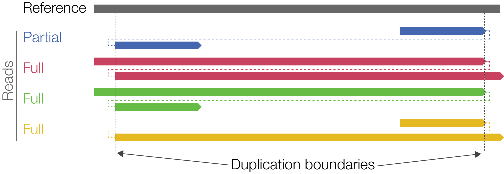

<h1 align="center"></h1>
<h1 align="center">pbsv</h1>
<p align="center">PacBio structural variant (SV) calling and analysis tools</p>

***

`pbsv` is a suite of tools to call and analyze structural variants
in diploid genomes from PacBio single molecule real-time sequencing (SMRT) reads.
The tools power the *Structural Variant Calling* analysis workflow in
PacBio's SMRT Link GUI.

`pbsv` calls insertions, deletions, inversions, duplications, and translocations.
Both single-sample calling and joint (multi-sample) calling are provided. `pbsv` is most
effective for:
* insertions 20 bp to 10 kb
* deletions 20 bp to 100 kb
* inversions 200 bp to 10 kb
* duplications 20 bp to 10 kb
* translocations between different chromosomes or further than 100kb apart on a single chromosome

## Availability
Latest version can be installed via bioconda package `pbsv`.

Please refer to our [official pbbioconda page](https://github.com/PacificBiosciences/pbbioconda)
for information on Installation, Support, License, Copyright, and Disclaimer.

## Latest Version
Version **2.2.2**: [Full changelog here](#full-changelog)

## Workflow
<p align="center"></p>

The general `pbsv` workflow is:
1. Align PacBio reads to a reference genome, per movie. (`.subreads.bam`/`.ccs.fastq` to `.bam`)
2. Discover signatures of structural variation. (`.bam` to `.svsig.gz`)
3. Call structural variants and assign genotypes, all samples. (`.svsig.gz` to `.vcf`)

### 1. Align PacBio reads to a reference genome
The recommended aligner is `pbmm2` that can be installed via `conda install pbmm2`.
For each movie (`.subreads.bam` or `.ccs.fq`) align records to a
reference genome (`ref.fa`).

Subreads BAM input:
```sh
pbmm2 align ref.fa movie1.subreads.bam ref.movie1.bam --sort --median-filter --sample sample1
```

CCS BAM input:
```sh
pbmm2 align ref.fa movie1.ccs.bam ref.movie1.bam --sort --preset CCS --sample sample1
```

CCS FASTQ input:
```sh
pbmm2 align ref.fa movie1.Q20.fastq ref.movie1.bam --sort --preset CCS --sample sample1 --rg '@RG\tID:movie1'
```

The sample name, stored in the `SM` tag of the read groups, associates
aligned reads with a particular sample.  It is required for downstream
joint calling.

### 2. Discover signatures of structural variation

For each aligned BAM or set of aligned BAMs, identify signatures
of structural variation. This reduces all aligned reads to those that are relevant
to calling structural variants. The signatures are stored in a `.svsig.gz` file.

```sh
pbsv discover ref.movie1.bam ref.sample1.svsig.gz
pbsv discover ref.movie2.bam ref.sample2.svsig.gz
```

It is highly recommended to provide one tandem repeat annotation `.bed` file
of your reference to `pbsv discover` via `--tandem-repeats`. This increases
sensitivity and recall. Feel free to use the following for human SV calling:
[GRCh38](https://github.com/PacificBiosciences/pbsv/blob/master/annotations/human_GRCh38_no_alt_analysis_set.trf.bed) or
[hs37d5/hg19](https://github.com/PacificBiosciences/pbsv/blob/master/annotations/human_hs37d5.trf.bed).

Sample names are transferred from the `RG` headers to the `.svsig.gz` file.

### 3. Call structural variants and assign genotypes

Call structural variants from structural variant signatures, jointly for all
samples of interest. One or more `.svsig.gz` files are accepted, including multiple
`.svsig.gz` for a single sample and/or `svsig.gz` for multiple samples.
If the input is CCS reads, please add `--ccs` to the following call:

```sh
pbsv call ref.fa ref.sample1.svsig.gz ref.sample2.svsig.gz ref.var.vcf
```

Variant calls for all samples are output in a single `.vcf` file.

### Parallel processing per chromosome
For large genomes with high sequencing coverage, it is recommended to process
chromosomes separately.  After aligning each movie:

#### Generate separate `.svsig.gz` files per chromosome

```sh
for i in $(samtools view -H hg38.movie1.bam | grep '^@SQ' | cut -f2 | cut -d':' -f2); do
    pbsv discover --region $i hg38.movie1.bam hg38.sample1.$i.svsig.gz
done
```

#### Call SVs per chromosome
```sh
for i in {chr1,chr2,chr3,chr4,chr5,...}; do
    pbsv call hg38.fa hg38.sample1.${i}.svsig.gz hg38.${i}.vcf
done
```
Be aware that each translocation will get called twice, when run per chromosome.
Even though the IDs will match, the `DP` information won't necessarily be identical.

To avoid that, call insertions, deletions, and inversions independent from
translocations:

```sh
for i in {chr1,chr2,chr3,chr4,chr5,...}; do
    pbsv call --types INS,DEL,INV,DUP,CNV hg38.fa hg38.sample1.${i}.svsig.gz hg38.${i}.ins+del+inv.vcf
done
pbsv call --types BND hg38.fa hg38.sample1.*.svsig.gz hg38.bnd.vcf
```

## Algorithm Overview and Advanced Parameters
### Deletions
<p align="center"></p>

Cluster options used during `pbsv call`:

```
SV Signature Cluster Options:
  --cluster-max-length-perc-diff   Do not cluster signatures with difference in length > P%. [25]
  --cluster-max-ref-pos-diff       Do not cluster signatures > N bp apart in reference. [200]
```

Number of flanks used for consensus generation:
```
Consensus Options:
  -x,--max-consensus-coverage      Limit to N reads for variant consensus. [20]
```

**Split deletions**: Deletions that are not fully aligned using the `D` cigar are recovered up to a
size of 100kb. Deletions greater than 100kb are currently called as translocations.

### Insertions
Insertion calling workflow is identical to the above described deletion workflow,
except for one additional criteria, the inserted sequence similarity check
during clustering:

```
SV Signature Cluster Options:
  --cluster-min-basepair-perc-id   Do not cluster signatures with basepair identity < P%. [10]
```

**Split insertions**: Insertions can be recovered from split split reads, if the
reference overlap of those split reads is less than `-k,--max-skip-split [100]`
and if the query distance is larger than 500 bp.

The explicit upper limit on the insertion size can be adjusted in `pbsv call`,
but be aware that predicting larger insertions will consume more memory!

```
  --max-ins-length   Ignore insertions with length > N bp. ["10K"]
```

### Inversions
<p align="center"></p>

An inversion signature is detected if a single read is split into three
alignments with different orientations / strands, either `+-+` or `-+-`.
Gaps in the reference, as depicted as `A`, are not constrained.
The maximum permitted reference overlap `B`, between consecutive alignments, is
configured in `pbsv discover`:

```
  -k,--max-skip-split   Ignore alignment pairs separated by > N bp of a read or reference. ["100"]
```

Clustering is performed on the inverted segment and uses the same criteria as deletion clustering.

The VCF call marks the most likely position and size of the inverted segment, as shown in this IGV screenshot:
<p align="center"></p>

### Translocations
Translocations are identified using breakends of individual split reads with
a query skip of less than `-k,--max-skip-split [100]`.
The minimum reads that support a BND (total over all samples), can be defined
with `--call-min-bnd-reads-all-samples [2]`.
All four breakend combinations are supported:
<p align="center"></p>

### Duplications
#### From split reads
Duplications can be identified from the following split-read signatures:
<p align="center"></p>

whereas a duplication has to include on fully spanning read to be flagged as **PASS**;
otherwise, it is filtered with **NotFullySpanned**.

The maximum size can be configures in `pbsv call`:

```
  --max-dup-length   Ignore duplications with length > N bp. ["100K"]
```

#### From insertion
In addition, each insertion is tested against its neighboring reference regions
and labeled as a duplication if it matches the reference with 80%.
**Caution:** Activating duplication calling has a negative impact when comparing
to GIAB, as GIAB labels everything as insertion or deletion.

### Copy number variations
Copy number variations (CNVs) are inferred from breakends.
Each breakend pair is tested for significant changes in the read depth signal
and for each breakend, the longest non-overlapping CNV is being reported.

The minimum length can be configured in `pbsv discover`

```
  --min-cnv-length    Ignore CNVs with length < N bp. ["1K"]
```

CNVs that are overlapping with or are encapsulated by a deletion are flagged
with `SHADOW`.

### Calling and Genotyping
An variant is output if it passes all of the following criteria:
* supported by at least `-A,--call-min-reads-all-samples [2]` reads total across samples,
* supported by at least `-O,--call-min-reads-one-samples [2]` in a sample,
* supported by at least `-S,--call-min-read-per-one-sample [20]` percent of reads in a sample,
* supported by at least `-P,--call-min-reads-per-strand-all-samples [1]` reads per strand total across samples,
* assigned a non-reference genotype in at least one sample;
  a sample is assigned a non-reference genotype for a variant if at least `--gt-min-reads [1]` reads
  support the variant.

For CCS input, using the `--ccs` mode in `pbsv call`, thresholds are relaxed to `-A 1 -O 1 -S 0 -P 10`.

### Filtering
The VCF filter column is

1) **PASS**
2) **NearReferenceGap**: variant is near (< `--filter-near-reference-gap [1K]`) from a gap (run of >= 50 Ns in the reference assembly)
3) **Decoy**: variant involves a decoy sequence, where the chromosome name contains `decoy`, `hs37d5`, or `hs38d1`
4) **NearContigEnd**: variant is near (< `--filter-near-contig-end [1K]`) from a contig end
5) **InsufficientStrandEvidence**: variant is not supported by at least (`--call-min-reads-per-strand-all-samples [1]`) reads in forward and reverse orientation
6) **NotFullySpanned**: duplication variant does not have any fully spanning reads

## Performance benchmarks
Using the [publicly available HG002 15kb CCS dataset](https://bit.ly/2RW1b3I),
we are tracking `pbsv` performance with respect to the genome in a bottle annotation version 0.6.

Step-by-step reproducibility and benchmarks can be found at [github.com/PacificBiosciences/sv-benchmark](https://github.com/PacificBiosciences/sv-benchmark).

## FAQ

### To where do I report bugs and ask questions about the pre-release version of `pbsv`?
Please refer to our [official pbbioconda page](https://github.com/PacificBiosciences/pbbioconda)
to report bugs and ask questions.

### Where can I find an example dataset to try `pbsv`?
For Genome in a Bottle sample HG002:

 * [10-fold CLR coverage](https://downloads.pacbcloud.com/public/dataset/HG002/Sequel-201810/)
 * [28-fold CCS coverage](https://bit.ly/2RW1b3I)

### The binary does not work on my linux system!
If you get `Illegal instruction` upon execution of `pbsv`, then your CPU is not supported.
A modern (post-2008) CPU with support for [SSE4.1 instructions](https://en.wikipedia.org/wiki/SSE4#SSE4.1) is required.

### Why do I have to use `--median-filter` for CLR data?
I'm not sure how deep your knowledge goes for the PacBio technology.
You might know that each ZMW contains a polymerase that sequences one
SMRTbell, which consists of your piece of DNA, we call insert, and PacBio's
hairpin adapters. This SMRTbell is being processed once the
acquisition starts and ends when either the polymerase dies or the
acquisition ends. Depending how large your insert and how long the
movie time is, it might happen that you read the same molecule
multiple times. In this case, a ZMW has multiple subreads (also called
CLR), originating from the same insert, from the forward and reverse
strands. If we were to align all subreads to the genome and call SVs,
it will happen that we call SVs that have support from multiple
subreads, but all of them are from the same ZMW. In NGS you would call
that PCR duplicates or some would refer to them as technical replicates.
One does not want to account evidence more than once per ZMW aka per
molecule.
The median filter picks one subread per ZMW, to be precise the subread
of median length, to have exactly one evidence per molecule. If you
don't use it, you will get false positive SV calls and the genotypes
will be wrong.

## Full Changelog
 * **2.2.2**:
   * Public release in SMRT Link 8.0.0
   * Fix `--sample`, used to override input type

 * 2.2.1:
   * Public release in SMRT Link 7.0.0
   * Add `—call-min-bnd-reads-all-samples`

 * 2.2.0:
   * Add duplications and copy number variations
   * Improved sensitivity for larger insertions and deletions
   * Simplified parameters and relaxed inversion calling criteria
   * Add `--ccs` support for `pbsv call`
   * ~5x `pbsv discover` speedup and minimize memory footprint
   * Add maximum variant limits for duplications and insertions, the latter improves memory footprint of `pbsv call`

 * 2.1.1:
   * Improve error output if reference and svsig contigs do not match
   * Add `IMPRECISE` to VCF header
   * Separate filter with semicolon

 * 2.1.0:
   * Algorithmic improvements to increase recall and sensitivity across all SV lengths
   * Add `SAC` Stranded Allel Counts for subread input
   * Remove `pbsv fasta` and rely on `pbmm2` input
   * Add `MATEDIST`,  distance between two breakends of a translocation if the two breakends are on the same contig
   * Fix VCF POS/REF/ALT and sorting to pass GATK `ValidateVariants` and allow VCF `bgzip` and `tabix`
   * Allow multiple sample names and multiple BAM inputs for `pbsv discover`
   * Allow length `KMG` suffix
   * Flag **NearContigEnd**
   * Allow breakend calling from single chromosome `svsig.gz`
   * Allow custom `--annotations` for known sequence types
   * Loop termination fix to properly fix the issue in the 2.0.2 patch
   * Decrease memory overhead in `pbsv discover`

 * 2.0.2: Fix rare `pbsv call` abort, because of missing coverage
 * 2.0.0: Drop RC for conda release
 * 2.0.0-RC2: First public release candidate for SMRT Link 6.0.0


## DISCLAIMER

THIS WEBSITE AND CONTENT AND ALL SITE-RELATED SERVICES, INCLUDING ANY DATA, ARE PROVIDED "AS IS," WITH ALL FAULTS, WITH NO REPRESENTATIONS OR WARRANTIES OF ANY KIND, EITHER EXPRESS OR IMPLIED, INCLUDING, BUT NOT LIMITED TO, ANY WARRANTIES OF MERCHANTABILITY, SATISFACTORY QUALITY, NON-INFRINGEMENT OR FITNESS FOR A PARTICULAR PURPOSE. YOU ASSUME TOTAL RESPONSIBILITY AND RISK FOR YOUR USE OF THIS SITE, ALL SITE-RELATED SERVICES, AND ANY THIRD PARTY WEBSITES OR APPLICATIONS. NO ORAL OR WRITTEN INFORMATION OR ADVICE SHALL CREATE A WARRANTY OF ANY KIND. ANY REFERENCES TO SPECIFIC PRODUCTS OR SERVICES ON THE WEBSITES DO NOT CONSTITUTE OR IMPLY A RECOMMENDATION OR ENDORSEMENT BY PACIFIC BIOSCIENCES.

FOR RESEARCH USE ONLY. NOT FOR USE IN DIAGNOSTICS PROCEDURES.
